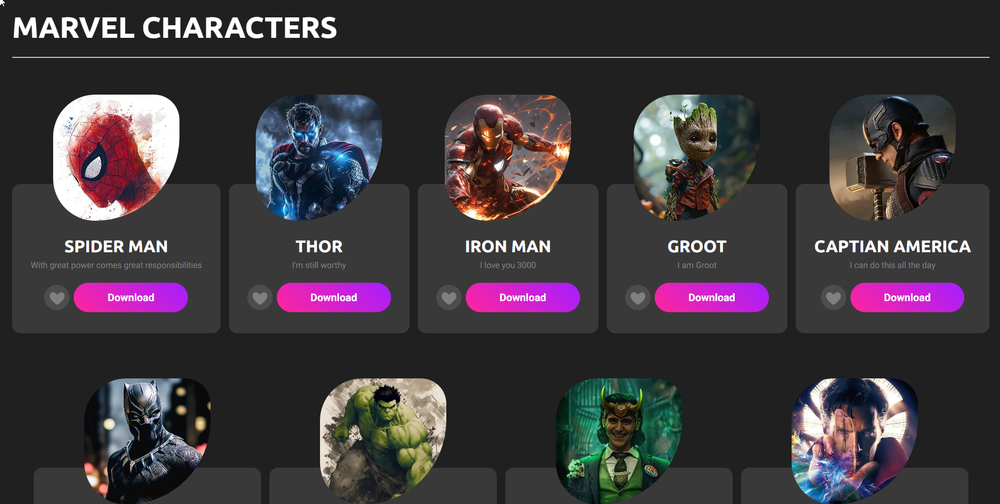

# Marvel Characters CSS Layout

A simple and responsive Marvel-themed webpage created using **pure HTML & CSS** to understand how **layouts** and **positioning** work in CSS.



---

## 🚀 Features

- ✅ Responsive layout for desktop and mobile
- 🎨 Pure CSS — no JavaScript used
- 📐 Focus on Flexbox, positioning, and styling
- ❤️ Downloadable character images
- 🖼 Images sourced from Pinterest (for educational purposes)

---

## 📱 Responsive Design

The layout adjusts seamlessly for smaller screens like mobiles and tablets, thanks to CSS flex and media queries.

---

## 📸 Image Attribution

- All character images are **sourced from Pinterest** and are **not owned by me**.
- They are used for educational/demo purposes only.
- If you're the copyright owner and want removal, feel free to open an issue.

---

## 🧪 What You’ll Learn

This project helps you understand:

- How **Flexbox** work
- Using **relative vs absolute** positioning
- Styling buttons, cards, and containers
- Building **responsive layouts** without frameworks

---

## 📥 Download and Run

Just clone the repo and open `index.html` in your browser:

```bash
git clone https://github.com/Trivikram-N/CSS-layout.git
cd CSS-layout
start index.html
```